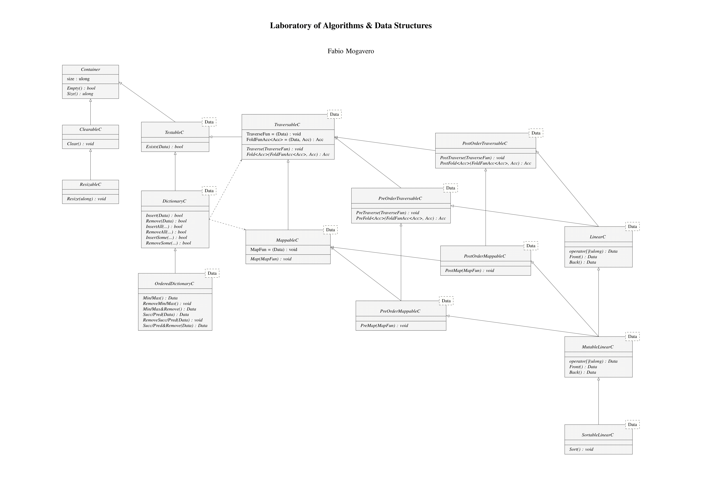

# Generic Data Structures in C++

Academic project for the "Algorithm and Data Structures Laboratory" course of University of Naples Federico II

## 📖 Overview

The library is designed with a hierarchical class structure, starting from abstract base classes (interfaces) that define behavior, leading down to concrete implementations. All data structures are **generic** (template-based), allowing them to store any data type (e.g., `int`, `double`, `std::string`, or custom objects).

## 📐 Implemented Data Structures

### 1. Vectors
A dynamic array implementation that manages memory manually.
* **Implementations**:
    * `Vector`: Standard dynamic array.
    * `SortableVector`: Extends Vector with sorting capabilities (Insertion Sort).

### 2. Lists
A generic Singly Linked List implementation.
* **Structure**: Maintains pointers to both `Head` and `Tail` for efficient operations.

### 3. Heaps
A Binary Heap implementation mapped onto a linear vector.
* **Features**:
    * `Heapify` operation.
    * `HeapSort` implementation.

### 4. Priority Queues
A data structure that manages a set of records with keys, where only the element with the highest priority is accessible.
* **Features**:
  * `Insert` operation.
  * `Remove Tip` operation.
  * `Change Priority` operation.

### 5. Sets
A collection of distinct elements. The implementations allow for existence checks, insertion, and removal.
* **Implementations**:
    * `SetVec`: Set implemented over a **sorted vector** (uses Binary Search for $O(\log n)$ lookup).
    * `SetLst`: Set implemented over a **linked list** (uses linear scan, keeps elements sorted).

## 🛠 Usage

Since the library uses C++ templates, you can include the necessary header files and instantiate the structures with your desired type.

```cpp
#include "vector/vector.hpp"
#include "list/list.hpp"
#include "heap/vector/heapvec.hpp"

using namespace lasd;

int main() {
    // Example: Create a Vector of integers
    Vector<int> myVector(10);
    
    // Example: Create a List of strings
    List<std::string> myList;
    myList.InsertAtFront("Hello");
    myList.InsertAtBack("World");

    // Example: Create a Heap from the vector
    HeapVec<int> myHeap(myVector);
    myHeap.Sort(); // HeapSort

    return 0;
}
```
## 📄 UML
You can find the UML class diagram describing the hierarchy here:
[](docs/ClassDiagram.pdf.pdf)

*Click on the image to view the full 3-page PDF diagram.*


